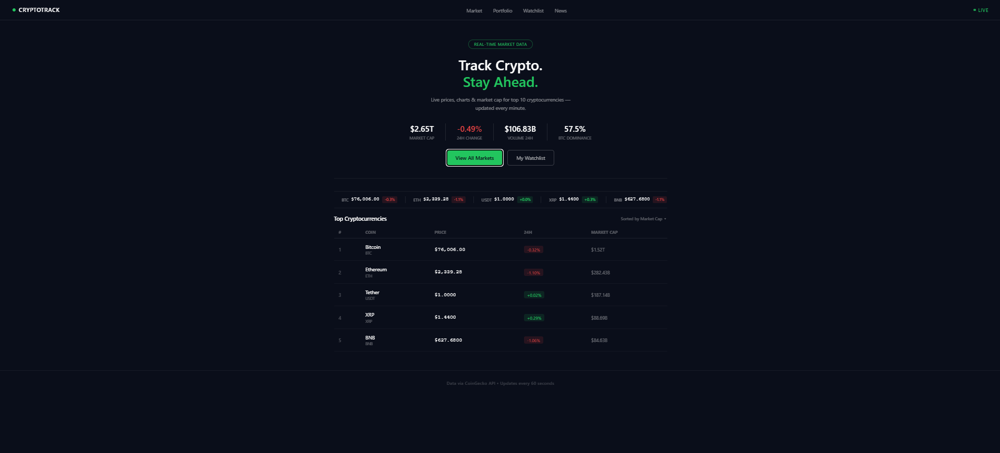

# CryptoTrack 🟢

A live cryptocurrency price tracker dashboard built with pure HTML, CSS, and JavaScript. Displays real-time prices, market cap, and 24h change for the top 5 cryptocurrencies — powered by the free CoinGecko API, no registration or API key needed.

## Live Demo

> Click here to view — [https://samiullah-2004.github.io/Crypto-Price-Tracker/]

---

## Preview



---

## Features

- Live prices for top 5 cryptocurrencies
- Global market stats — total market cap, 24h volume, BTC dominance
- Green / red indicators for 24h price change
- Ticker bar with instant coin overview
- Auto-refreshes every 60 seconds
- Clean dark terminal-style UI
- Uses free CoinGecko public API — no registration or API key needed

---

## Tech Stack

| Technology | Purpose |
|---|---|
| HTML | Page structure |
| CSS | Styling and dark theme |
| JavaScript | API calls, DOM updates |
| CoinGecko API | Live crypto market data |

---

## APIs Used

**Global market data (hero stats):**
```
GET https://api.coingecko.com/api/v3/global
```

**Top 10 coins (ticker + table):**
```
GET https://api.coingecko.com/api/v3/coins/markets?vs_currency=usd&order=market_cap_desc&per_page=5&page=1&sparkline=false
```

Both endpoints are free and require no authentication.

---

## Project Structure

```
crypto-price-tracker/
│
├── index.html       # Main page structure
├── style.css        # All styling and dark theme
├── script.js        # API calls and DOM updates
├── favicon.ico      # Browser tab icon
└── README.md        # Project documentation
```

---

## How It Works

1. On page load, `script.js` makes two `fetch()` calls to CoinGecko
2. Global stats (market cap, volume, BTC dominance) fill the hero section
3. Top 10 coins fill the ticker bar and the price table
4. `setInterval()` repeats both calls every 60 seconds for live updates

---


---

## Author

**Sami** — Aspiring Full Stack Web Developer  
Building real projects to grow freelance skills.

---

## License

This project is open source and free to use.
